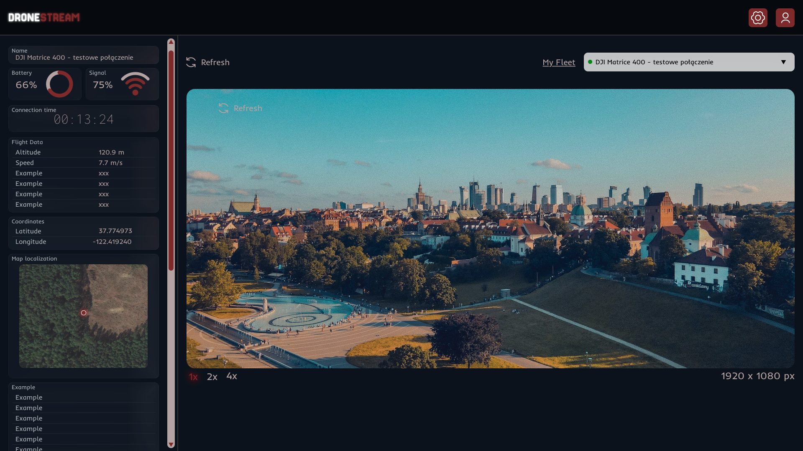

# DroneStream

## Opis projektu

DroneStream to aplikacja umożliwiająca monitorowanie i zarządzanie flotą dronów w czasie rzeczywistym.

## Zakres

- umożliwia strumieniowanie obrazu z dronów w czasie rzeczywistym
- prezentuje aktualną pozycję drona na interaktywnej mapie
- pozwala na równoległe monitorowanie wielu urządzeń

## Makieta interfejsu

## Technologie

- .NET 10
- Docker
- React
- OpenLayers
- mediamtx
- emqx
- signalR

## Testowanie lokalnie

Na tym etapie jest możliwość przetestowania:

- frontend'u wpisując polecenia w katalogu /frontend `npm i ` potem ` npm run build`
- backend'u wpisując polecenia w katalogu /backend `dotnet run `
- backend'u z frontend'em wpisując `docker compose up`

## Struktura projektu

## Uruchomienie aplikacji

## Autorzy

- [Vladys Berezhnyi](https://github.com/WladekBBC)
- [Krystian Czajkowski](https://github.com/krystianczajkowski)
- [Piotr Piotrowski](https://github.com/piotrusio02)
- [Nikola Ostrowska](https://github.com/nikostrowska)
- [Marcin Bendyk](https://github.com/marcinbendyk)
