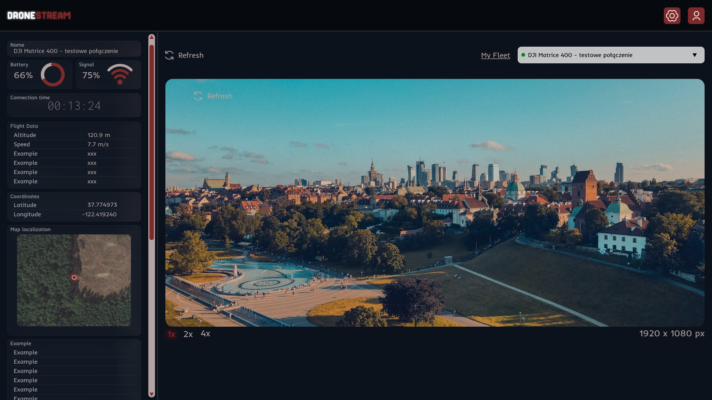

# 🚁 DroneStream

> Real-time drone fleet monitoring and management platform.

## 📖 Overview

DroneStream is a web application for real-time monitoring and management of drone fleets.
It streams live video feeds, collects telemetry data, and visualizes drone positions on an interactive map,
all simultaneously across multiple devices.

## ✨ Features

- **Live video streaming** from drones via mediamtx
- **Telemetry ingestion** from `.srt` data packets sent by drones
- **Interactive map** showing real-time drone positions (OpenLayers)
- **Parallel monitoring** of multiple drones at once
- **Real-time communication** via SignalR (WebSocket)
- **Message broker** integration via EMQX (MQTT)

## 🖼️ UI Preview



## 🛠️ Tech Stack

- .NET 10
- SignalR
- React
- TypeScript
- Vite
- OpenLayers
- mediamtx
- EMQX (MQTT broker)
- Docker

## 🔧 Requirements

[Docker](https://www.docker.com/) & Docker Compose

## 🚀 Getting Started

```bash
git clone https://github.com/nikostrowska/DroneStream.git
docker compose up
```

## 📁 Project Structure

```
DroneStream/
├── backend/                    # ASP.NET Core API
│   ├── Controllers/            # Endpointy HTTP
│   ├── Data/                   # Kontekst bazy danych
│   ├── DTOs/                   # Obiekty transferu danych
│   ├── Hubs/                   # SignalR (WebSocket)
│   ├── Models/                 # Modele domenowe
│   ├── Repositories/           # Warstwa dostępu do danych
│   ├── Services/               # Logika biznesowa
│   ├── Workers/                # Obsługa brokera
│   ├── Program.cs              # Punkt wejścia aplikacji
│   └── Dockerfile
├── frontend/                   # React + Vite + TypeScript
│   ├── src/
│   │   ├── assets/             # Statyczne zasoby
│   │   ├── components/         # Komponenty UI
│   │   ├── pages/              # Widoki/strony
│   │   └── types/              # Typy TypeScript
│   ├── index.html
│   └── Dockerfile
├── mediamtx/                   # Serwer strumieniowania wideo
│   └── Dockerfile
├── img/                        # Makiety i zasoby graficzne
├── docker-compose.yml          # Orchestracja kontenerów
└── .gitignore
```

## 👥 Authors

- [Vladys Berezhnyi](https://github.com/WladekBBC)
- [Krystian Czajkowski](https://github.com/krystianczajkowski)
- [Piotr Piotrowski](https://github.com/piotrusio02)
- [Nikola Ostrowska](https://github.com/nikostrowska)
- [Marcin Bendyk](https://github.com/marcinbendyk)
